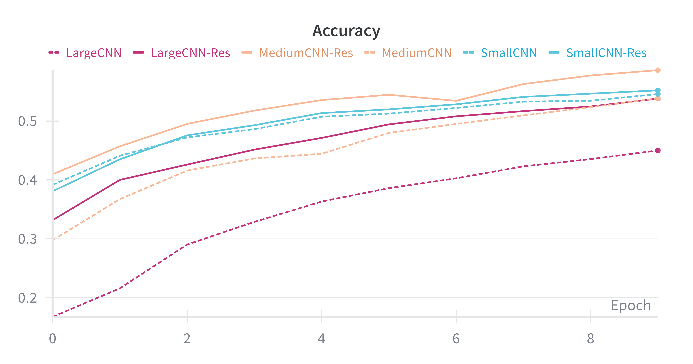
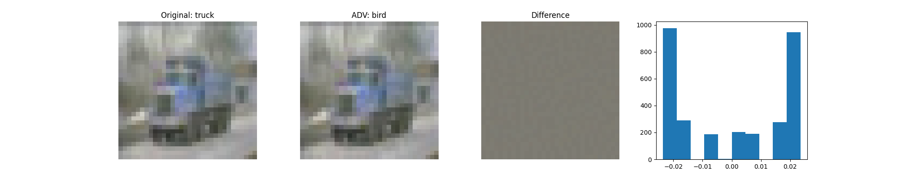
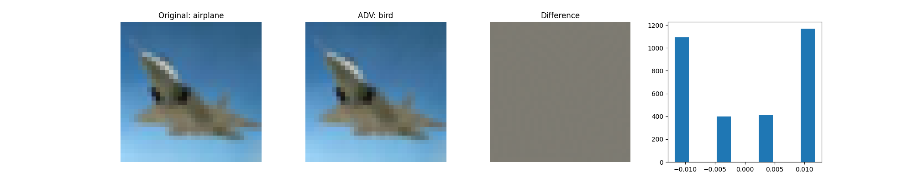

# DLA_Labs
In this repo, you’ll find all the code I wrote and the results I collected for the DLA labs.  

In all the labs I use custom function that you can find in `my_custom_ai/`:  
* `my_custom_ai/requirements.txt`
* `my_custom_ai/README.txt`
* `my_custom_ai/custom_train/` module with the custom train function
* `my_custom_ai/utils` module with utilities

## Lab1 - CNNs
In this lab I will try to duplicate (on a small scale) the results of the ResNet paper:  

Deep Residual Learning for Image Recognition, Kaiming He, Xiangyu Zhang, Shaoqing Ren, Jian Sun, CVPR 2016.  

  
📂 Code organization

  - `checkpoints/` contains the best model I trained
  - `augmented_datasets/` augmented version of CIFAR-10 (used for the distillation exercise)
  - `models/` includes `models.py` (with the MLP and CNN definitions) and `sublayers.py` (with the residual block definition)
  - `utils/`
  - `imgs/` includes all the plots I collected for the experiment
  - `main.py` defines the functions **reproduce_resnet_results** and **distillation_experiment**

  
 Expand Lab1 

## First exercise
In the first exercise, I trained a multi-layer perceptron (MLP) classificator on MNIST, occasionally adding skip connections to study how the model’s classification performance varies with network depth.

  
  
  

Note that d1 and d5 stand for depth=1 and depth=5, where the depth is the number of blocks the network is composed of; each block has 2 linear layers and skip connections that one can choose to use (see **MLP** module in `models/models.py` for details on architecture).  

I tried the same experiment with a CNN, using CIFAR-10 (MNIST is too simple for a CNN; note that an MLP achieves ≈0.98 in a few epochs). 
Three different models have been investigated:
- SmallCNN
- MediumCNN
- LargeCNN
  
All models start with a convolutional layer that expands the 3 input channels to 32. The models are then built from custom blocks, each containing two convolutional layers (with a configurable number of channels, 32 for all the experiments) followed by a 1x1 convolution that allows adjusting the total number of filters. The network ends with a classification head
(see **CNN** module in `models/models.py` for details on architecture). Details are as follows:

| Name           | blocks | params | Conv layers|
|:---------------|:------:|-------:|:----------:|
| SmallCNN       |  2     |     13k|        6   |
| SmallCNN Res   |  2     |     13k|        6   |
| MediumCNN      |  5     |    160k|      21    |
| MediumCNN Res  |  5     |    160k|      21    |
| LargeCNN       |  7     |    240k|      29    |
| LargeCNN Res   |  7     |    240k|      29    |

Here you can see the results:

  
  
  

The trend mirrors that observed with MLPs: in the absence of skip connections, deeper neural networks tend to perform worse.
## Second exercise

From the previous graphs, it is evident that the models were trained for only 10 epochs due to time constraints. However, to perform knowledge distillation, a model with better performance than those previously described is required. For this reason, a CNN with 2 blocks and approximately 1M parameters was trained as the teacher model (you can find this model in `checkpoints/`). A model version with fewer filters (and therefore fewer parameters) but the same number of blocks was used as the student model.

| Name           | blocks | params | Conv layers|
|:---------------|:------:|-------:|:----------:|
| Teacher        |  2     |     1M |        6   |
| Student        |  2     |    200k|        6   |

To train the student, the following procedure was followed:
* A dataset was constructed containing the probability distributions predicted by the teacher for each training image, to improve efficiency.
* A combination of cross-entropy loss (on the hard labels) and KL divergence loss (on the soft labels from the teacher) was employed.

  
  
  

As shown in the graphs, after distillation the student is able to achieve better performance compared to its non-distilled version.

# Lab 3 Working with Transformers
In this laboratory exercise we will learn how to work with the HuggingFace ecosystem to adapt models to new tasks.  

  
📂 Code organization

  
  - `utils/`
  - `imgs/` includes all the plots I collected for the experiment
  - `main.py` includes the **baseline** and **finetuning** pipeline
  - `models.py` includes **SimplerSentenceClassifier** module

  

  
 Expand Lab3 

  ## Dataset
  There are a many sentiment analysis datasets, but we will use one of the smallest ones available: the Cornell Rotten Tomatoes movie review dataset, which consists of 5,331 positive and 5,331 negative processed sentences from the Rotten Tomatoes movie reviews.  
  The objective is to construct a classifier capable of distinguishing examples from the two classes.

  ## Baseline
  The first step involves establishing a baseline for comparison with all future results. For this purpose, several pre-trained models will be employed, each augmented with a two-layer MLP classification head. The results are presented below.  

  | Name           | size     | train_acc  | val_acc|
|:---------------|:--------:|-----------:|:------:|
| DistilBert     |  66M     | 0.846      |  0.825 |
| SBert          |  22.7M   |   0.751    | 0.738  |
| SBert          |  109M    |    0.882   | 0.851  |
  

  
  

## Finetuning
This section examines the performance of DistilBERT following fine-tuning. Despite the model's relatively small size (66M parameters), training can be computationally intensive on standard hardware. To address this, efficient fine-tuning methods have been investigated to minimize the number of parameters requiring optimization. The approach employed is LoRA (Low-Rank Adaptation).  
Various ranks for the low-rank matrices and different modules were experimented with.

 | Modules       | rank     | train_params   |   acc      |
|:---------------|:--------:|:--------------:|-----------:|
| q              |  8       |     660k       | 0.849      |
| q              |  16      |       740k     |   0.848    |
| qv             |  8       |       740k     |    0.843   |
| qv             |  16      |        890k    |    0.843   |
| qvk            |  8       |       810k     |    0.849   |
| qvk            |  16      |       1M       |    0.849   |
| Full           |  -       |      66M       |  0.859     |

See `imgs/` for more metrics and details.  
As illustrated in the table, LoRA achieves results comparable to full fine-tuning, despite requiring the update of significantly fewer parameters.

  

# Lab4 - Adversarial Learning
In this laboratory session I will develop a methodology for detecting OOD samples and measuring the quality of OOD detection. I will also experiment with incorporating adversarial examples during training to render models more robust to adversarial attacks.

  
📂 Code organization

  - `checkpoints/` contains the autoencoder trained in `autoencoder_training.py` and the classificator trained in `robust_cls_training.py`
  - `imgs/` includes all the plots I collected for the experiment
  - `models/` includes `models.py` (with the AutoEncoder module definitions)
  - `utils/` 
  - `adversarial_attack.py` main program for adversarial attack
  - `autoencoder_training.py`
  - `detection_main.py` main program for the OOD pipeline
  - `robust_cls_training.py` Main script for training the classifier on the augmented dataset (including attacked images).

  
 Expand Lab4 
  

## First exercise
In this exercise, adversarial examples of the original dataset images are generated using the FGSM method. Both untargeted and targeted attacks are performed (see `adversarial_attack.py` for details). The generated images are presented below.  
**Targeted attack**

  
  
  
  
  

**Unargeted attack**

  
  
  
  
  

FGSM allows the generation of adversarial images that appear indistinguishable to the human eye—showing only minimal differences from the original—yet successfully deceive the classifier (which had an accuracy of about 0.88).

## Second exercise
In this exercise, we present the pipeline used for OOD detection.  

### Datasets
For the ID dataset, we used the CIFAR-10 test set (10000 samples), while the OOD datasets included:
* the people class from CIFAR-100 (2500 samples)
* synthetic noise generated with the FakeData dataset

### Models
Two models were used for OOD detection:
* the best-performing model from Lab1 (`lab1/checkpoints/cnn_d2_res_bigger.pth` )
* an autoencoder, where the encoder is the feature extractor of the best model and the decoder is composed of three convolutional layers.

During training (see `autoencoder_training.py`), the encoder was kept frozen, and only the decoder weights were updated.

### Results
Below we report the results obtained with the two models described above  

 **Fake Dataset**
 

  
  

  
  

  

The graphs show that both metrics achieve strong results, with MSE detecting 100% of the OOD samples. This is likely because the Fake Dataset examples are pure noise, and therefore entirely different from the images on which the model was trained (CIFAR-10).

**People OOD Dataset**

  
  

  
  

  

When using the people class from CIFAR-100 (unseen during training) as OOD, the classifier is still able to discriminate between ID and OOD samples, albeit with lower performance than in the previous case. This is likely because CIFAR-100 images exhibit patterns that are relatively similar to those learned during CIFAR-10 training.

## Third exercise
In the third exercise, we train a model on a dataset augmented with FGSM-generated adversarial images, with the goal of assessing its performance on the OOD detection task. The augmentation was performed on the fly. For each batch, random 10% of the images was selected to be attacked.  
The network was trained using a combination of cross-entropy loss on the ID samples and KL divergence loss on the OOD examples (see `robust_cls_utils.py` for more details), with a uniform distribution as the target. This approach encourages the network to remain as uncertain as possible when classifying OOD data. The results are presented below.

 **Fake Dataset**

  
  

**People OOD Dataset**

  
  

## Paper video presentation
Here you will find the video presentation of the paper:  
An Image is Worth One Word: Personalizing Text-to-Image Generation using Textual Inversion,  
Rinon Gal, Yuval Alaluf, Yuval Atzmon, Or Patashnik, Amit H. Bermano, Gal Chechik, Daniel Cohen-Or
https://drive.google.com/file/d/1P9jE596POHiGIWPJd3RCa-RTkHInK_NZ/view?usp=drive_link

Notably, training on the augmented dataset causes the classification of OOD samples to shift leftward in the histogram, suggesting that the model is less confident in predicting classes for OOD data. Additionally, overall performance is slightly lower than when using the non-augmented dataset.
